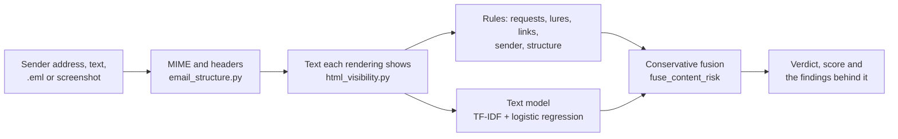

# PhishGuard — Phishing & Scam Email Detection

> CS 166 (Information Security) final project, continued as a personal project.
> Live demo: <https://phishguard-email-analyzer.vercel.app> ·
> Changes: [CHANGELOG.md](CHANGELOG.md)

PhishGuard is a FastAPI web application that screens an email for phishing and explains
every finding. It reads a sender address, a pasted subject and body, an original `.eml`
file, or a screenshot (its text and QR codes are read in the browser), and returns a
verdict together with the rule, link, sender and structure evidence behind it. Scores are
explainable heuristics, not calibrated probabilities.

## What it checks

- **Sender and domain:** look-alike brand names and digit substitutions, risky TLDs,
  IP-literal and deep subdomains, disposable and privacy-relay providers.
- **Message content:** requests for one-time codes, passwords, payments or callbacks;
  mailbox, delivery, fine, subsidy and account-hold lures; links whose text and destination
  disagree; hidden and salted text; PDF and Word attachment text.
- **Message structure:** MIME parsing with bounded nesting, attached messages, SPF, DKIM and
  DMARC results from a receiving service the reader names (Gmail or Outlook.com) or a
  verified Google ARC seal, and a registry of official sending domains.
- **Text model (optional):** word and character TF-IDF with logistic regression, loaded
  from a digest-pinned artifact and fused conservatively with the evidence above.
- **Domain checks:** MX, SPF, DMARC, PTR, WHOIS and RDAP; SMTP probing only when run
  locally.

Details: [detection design](docs/detection-design.md) and [API](docs/api.md).

## How a verdict is made



- Rule, sender, link and structure findings set a minimum level, and weak evidence cannot
  average a strong finding away.
- The text model alone is a **note, not an alert** ("Low Risk — Text Model Signal Only").
  With weak rule evidence beside it, it raises the message to High for review.
- A request or lure found only in text that styles may hide is marked as such and alerts
  at Medium; the model never scores hidden text.
- A trusted DMARC pass from a registered official domain keeps text-model and weak-rule
  alerts at Low. Strong findings, such as a request for a code, still alert.
- When part of a message cannot be read (uncertain styles, images, attachments), the
  result says so, and often reads **Analysis Incomplete** rather than Safe.

## How well it works

Measured with the full serving pipeline on 2026-10-04 and 10-05, before this branch's
2026-10-05 changes ([evaluation log](docs/evaluation.md)):

| Cohort | Alerts |
|---|---:|
| The owner's 92 genuine emails, pasted as text | 35 (38%) |
| The same, as `.eml`, mailbox not chosen | 24 (26%) |
| The same, as `.eml` downloaded from Gmail or Outlook.com and chosen | 3 (3%) |
| UniqueData legitimate (58) | 39 (67%) |
| PhishFuzzer recent legitimate seeds (102) | 63 (62%) |
| Nazario phishing, 2015–25 (3,466) | 3,445 (99.4%) |
| PhishFuzzer recent phishing seeds (103) | 88 (85%) |

- Most false alerts come from the text model. It was trained on public corpora whose
  genuine mail is mostly from 2002–2008, and it transfers poorly to corpora it has not
  seen ([leave-one-source-out](docs/evaluation.md#4-leave-one-source-out-model-evaluation)).
- Making a model-only score a note costs far more recall on pasted text than on `.eml`
  files: on local public corpora, Nazario alerts fell from 96.5% to 71.2% and PhishNChips
  from 99.3% to 43.5%, while false alerts fell too. It is not yet measured on the cohorts
  above.
- The rules are tuned on the same cohorts they are measured on, and no independent holdout
  has been run yet. Read these as development measurements, not production accuracy.

## Limitations

- PhishGuard is not a mail filter. A Safe or Low result does not prove that a message is
  safe, and the score is not a probability.
- Chinese mail is read by the rules only: the text model was not trained on it. Of 611
  unlabelled DataCon 2023 Chinese messages, 57% end undetermined.
- The HTML and CSS reader is not a browser or a mail client, so text that depends on
  rendering can still be misread.
- Remote images, image meaning beyond in-browser OCR and QR, and attachment malware are
  outside its scope.

## Quick start

```bash
python3.12 -m venv .venv
.venv/bin/python -m pip install -r requirements-dev.txt
APP_ENV=development CONTENT_MODEL_ENABLED=false .venv/bin/uvicorn app:app --app-dir website --host 127.0.0.1 --port 8000
```

Then open <http://127.0.0.1:8000>. This starts the rules-only analyzer. To load the
committed text model, also set `CONTENT_MODEL_ENABLED=true`, and copy
`CONTENT_MODEL_ARTIFACT` and `CONTENT_MODEL_ARTIFACT_SHA256` from `vercel.json`. Use Python
3.12, which the artifact requires; see [deployment](docs/deployment.md) for every setting.

## Testing

```bash
.venv/bin/python -m unittest discover -s website/tests
node --test website/static/*.test.mjs
```

CI also lints with `ruff`, smoke-tests the Vercel profile and compares screenshots; see
[testing](docs/testing.md).

## Project structure

```text
Phishing-Scam-Email-Detection/
├── app.py                      # Vercel entry point; imports website/app.py
├── vercel.json, render.yaml    # deployment profiles
├── requirements*.txt           # pinned runtime and development dependencies
├── website/
│   ├── app.py                  # API, content rules, link checks, fusion, domain checks
│   ├── html_visibility.py      # HTML parsing, CSS cascade and the text each rendering shows
│   ├── email_structure.py      # RFC 5322/MIME, authentication results, official senders,
│   │                           #   PDF and Word attachment text
│   ├── sender_features.py      # sender-address features and domain registries
│   ├── content_model.py        # offline text-model training and evaluation
│   ├── content_inference.py    # digest-verified model loading and scoring
│   ├── language_coverage.py    # script coverage (Han text)
│   ├── server_messages.py      # message codes and English templates
│   ├── visual_evidence.py      # browser OCR/QR evidence; enhanced_vision.py: optional RapidOCR
│   ├── local_review.py         # optional local language-model review (development only)
│   ├── case_*.py, manage_case_access.py, feedback_*.py   # optional /cases workspace and reports
│   ├── jev.py, jev_control.py  # experimental Jev opinions
│   ├── sender_history.py, rate_limits.py, request_limits.py, domain_age.py,
│   │   ip_reputation.py, disposable_registry.py, verification_runtime.py,
│   │   model_environment.py, config.py, prebuild_demo_model.py
│   ├── data/                   # registries and the message catalogue
│   ├── model/                  # committed, digest-pinned text-model artifact
│   ├── static/                 # frontend (vanilla JavaScript, English and Chinese)
│   ├── tools/                  # evaluation, data and maintenance scripts
│   └── tests/                  # Python regression tests
├── docs/                       # design, API, deployment, evaluation and workflows
└── phishing-detection/         # archived CS 166 benchmark: UCI phishing websites
```

## Documentation

- [Detection design](docs/detection-design.md): sender mode, full-message mode, the
  questions only the reader can answer, the mail-type note and the text classifier.
- [API and message codes](docs/api.md)
- [Deployment, configuration and Python environments](docs/deployment.md)
- [Data, text model and benchmarks](docs/data-and-model.md)
- [Testing](docs/testing.md)
- [Optional features](docs/optional-features.md): the case workspace, image and QR
  recognition, enhanced OCR, the local language-model review and Jev opinions.
- [Evaluation log](docs/evaluation.md), [case workflow](docs/case-workflow.md) and the
  [official-brand registry checklist](docs/official-registry.md)

## Course benchmark

The [UCI Phishing Websites notebook](phishing-detection/README.md) is the archived CS 166
course benchmark. It classifies websites from 30 URL, domain and HTML features; its
results (Random Forest accuracy 0.9747) do not describe this email detector.

---

*CS 166 – Information Security | Final Project*
